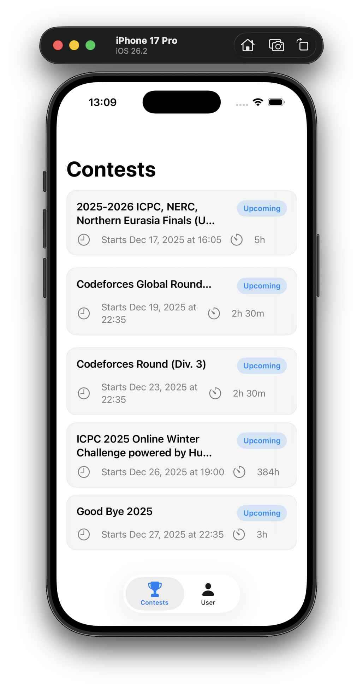
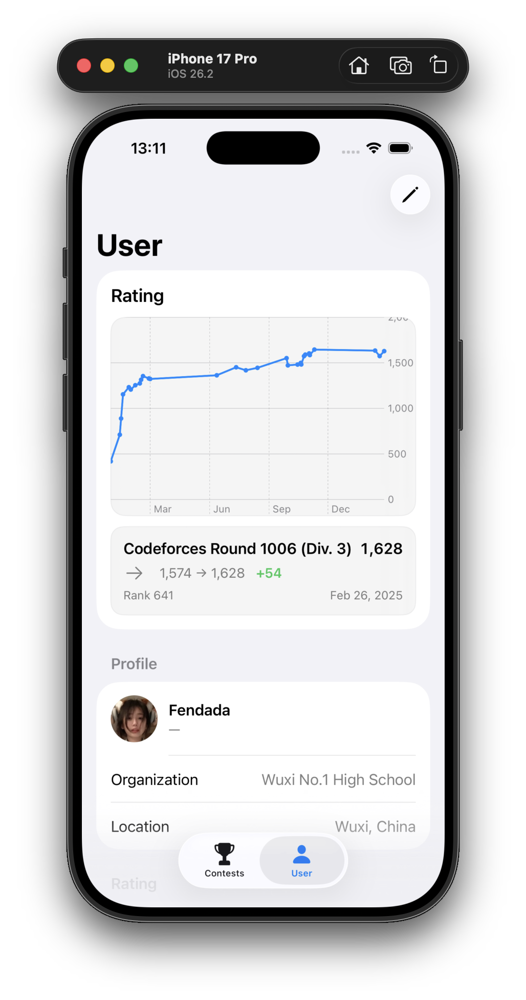
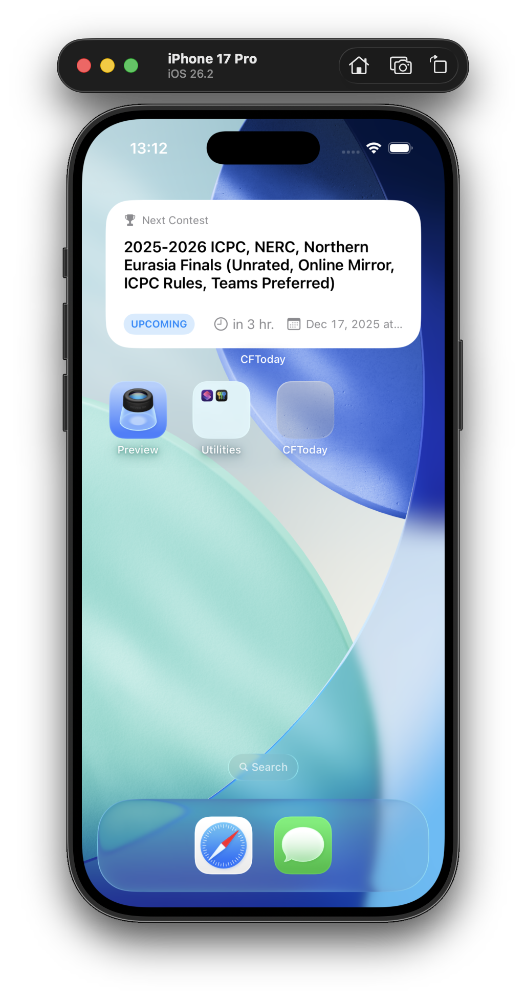

# CFToday

A lightweight iOS client for Codeforces, built with SwiftUI.

## App

  
  

## Widget

  

---

## Features

### Contests
- Display **Running** and **Upcoming** Codeforces contests
- Sorted by distance to current time
- Card-style Apple-like UI
- Show contest name, status, start time and duration

### User
- First launch prompts for Codeforces handle
- Handle is validated via Codeforces API
- Handle is persisted locally
- Display user information from `user.info`
  - Avatar and handle
  - Rank, rating and max rating
  - Organization and location
  - Registration time and last online time

### Rating
- Interactive rating history chart
- Tap or drag to inspect contest rating changes
- Show old rating → new rating and rank per contest

---

## Local Development

### Requirements
- macOS with **Xcode**
- iOS 16 or later (Swift Charts required)

### Run Locally
1. Clone the repository
2. Open the project in Xcode
3. Select an iOS simulator or a physical device
4. Build and run

On first launch, the app will ask for a Codeforces handle.

---

## Data Source

All data is fetched from the official **Codeforces public API**.

## Planned Features

- [ ] **Richer User Interaction**
  - Improve interactions on the rating chart (selection, highlighting, details)
  - Allow switching between different time ranges (recent / all)

- [ ] **Contest Reminders**
  - Set local notifications for upcoming contests
  - Custom reminder time (e.g. 10 minutes before start)

- [ ] **Widgets**
  - [x] Home Screen widget showing next contest and countdown
  - Lock Screen widget with contest status

- [ ] **Live Activities / Dynamic Island**
  - Display ongoing contest progress on the Lock Screen
  - Show remaining time for running contests in Dynamic Island

- [ ] **Calendar Integration**
  - Add contests directly to the system calendar
  - Automatic start/end time mapping with contest duration

- [ ] **Multi-User Support**
  - Save and switch between multiple Codeforces handles
  - Compare rating histories between users

